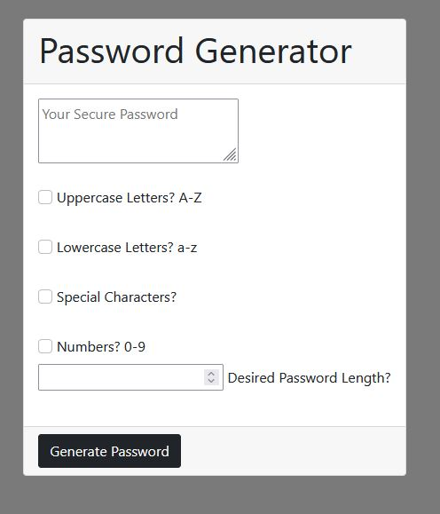

# password-Gen-v2

## Description

basic: html, css, javascript

password generator attempt 2

Motivated by how much help I needed the first attempt at making this password-gen. i thought about giving it another try. using javascript, css (w/ bootsrap), html. generate random passwords based on criteria that is selected. The app run's in the browser and will feature dynamically updated HTML and CSS powered by JavaScript. The Interface also adapts to multiple screen sizes.

## Usage

- Select desired characters for password.
- Enter desired Password-Length.
- Generate Button to start.
   

## License
 

---
🏆 The previous sections are the bare minimum, and your project will ultimately determine the content of this document. You might also want to consider adding the following sections.
## Badges

Badges aren't necessary, per se, but they demonstrate street cred. Badges let other developers know that you know what you're doing. Check out the badges hosted by [shields.io](https://shields.io/). You may not understand what they all represent now, but you will in time.
## Features
